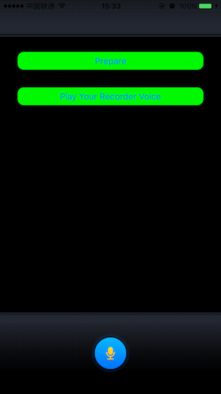

# 使用AudioQueueNewInput录制音频
除了可以使用“AudioQueueNewOutput”来播放音频，还可以使用"AudioQueueNewInput"创建的AudioQueue进行音频的录制，既然是AudioQueue，其使用方式也是和前面类似的：

1. 定义一个自定义的数据结构来维护当前的状态、音频数据格式等信息。
2. 设置数据文件格式
3. 实现AudioQueueOutputCallback回调函数，用来提供音频数据。
4. 创建一个Audio Queue用于播放音频使用
5. 分配并将buffer内容enqueue到上面的队列中，准备播放和停止操作
6. 最后释放Queue对象以及其他资源。
这里的步骤和前面播放也有些不同，不用去关心AudioStreamPacketDescription，因为他是录制的时候生成的，但是主要步骤还是相同的，先设置一些准备工作，然后就是通过回调来进行驱动。参见Demo：

这里先点击“Prepare”然后再开始录制，录制的过程将文件存入到了文件中，最后通过AVAudioPlayer进行播放。Demo参见[GitHub](https://github.com/cz-it/play_and_record_with_coreaudio/tree/master/audiotoolbox/audioqueue/examples/AudioQueueRecorderDemo)

## 录音器状态

和“AudioQueueNewOutput”这里也定义一个数据结果来维护录制的中间状态。参见Demo中的：

	struct RecorderStat
	{
	    AudioStreamBasicDescription   mDataFormat; // 录制的数据的格式信息
	    AudioQueueRef                 mQueue;  // Queue对象
	    AudioQueueBufferRef           mBuffers[kNumberBuffers]; // Buffer数组，获得录制的数据
	    AudioFileID                   mAudioFile; // 要存入的文件
	    UInt32                        bufferByteSize; // 单个Buffer的长度
	    SInt64                        mCurrentPacket; // 当前为哪个Packet
	    bool                           mIsRunning; // 是否停止
	};	
	
每个变量的一样在注释中均已标出，基本和播放时差不多。

## 设置AudioSession
因为系统默认的Session是“AVAudioSessionCategorySoloAmbient”（在[AVAudioSession](../avfoundation/avaudiosession.html)中有介绍),是不支持录制动作的，所以我们需要在录制的时候设置Session为“AVAudioSessionCategoryRecord”，再再播放的时候设置为“AVAudioSessionCategorySoloAmbient”:

	- (void) setAudioSession: (DemoMode) mode {
	    NSError *error;
	    AVAudioSession *session = [AVAudioSession sharedInstance];
	
	    [session setActive:YES error:&error]; // should not invoke every time
	    if (nil != error) {
	        NSLog(@"AudioSession setActive error:%@", error.localizedDescription);
	        return;
	    }
	    
	    error = nil;
	    NSString *category;
	    if (DemoModeRecord == mode) {
	        category = AVAudioSessionCategoryRecord;
	    } else {
	        category = AVAudioSessionCategorySoloAmbient;
	    }
	    
	    [[AVAudioSession sharedInstance] setCategory:category error:&error];
	    if (nil != error) {
	        NSLog(@"AudioSession setCategory(AVAudioSessionCategoryPlayAndRecord) error:%@", error.localizedDescription);
	        return;
	    } else {
	        NSLog(@"set category to %@", category);
	    }
	}	
 	
这里用“DemoModeRecord”枚举表示了录制模式。

## 设置要录音的数据格式
当播放时，是从源数据中获得数据格式，而录制的时候则需要我们来指定，通常就是文件格式、采样率、通道数、位深度这几个最基本的属性：

    // step 1: set up the format of recording
    recorderStat_.mDataFormat.mFormatID =  kAudioFormatLinearPCM;
    recorderStat_.mDataFormat.mSampleRate = 44100.0;
    recorderStat_.mDataFormat.mChannelsPerFrame = 2;
    recorderStat_.mDataFormat.mBitsPerChannel = 16;
    recorderStat_.mDataFormat.mFramesPerPacket = 1;
    recorderStat_.mDataFormat.mBytesPerFrame = recorderStat_.mDataFormat.mChannelsPerFrame * recorderStat_.mDataFormat.mBitsPerChannel / 8;
    recorderStat_.mDataFormat.mBytesPerPacket = recorderStat_.mDataFormat.mBytesPerFrame * recorderStat_.mDataFormat.mFramesPerPacket;
    recorderStat_.mDataFormat.mFormatFlags = kLinearPCMFormatFlagIsPacked | kLinearPCMFormatFlagIsSignedInteger | kAudioFormatFlagIsBigEndian;
    
这里还指定了PCM数据中每个Packet中有几帧，每帧数据大小等信息。  

## 创建AudioQueue
这里我们需要用AudioQueueNewInput来创建一个用于录音的AudioQueue  ：

	extern OSStatus             
	AudioQueueNewInput(                 const AudioStreamBasicDescription *inFormat, // 录音格式
	                                    AudioQueueInputCallback         inCallbackProc, // 回调
	                                    void * __nullable               inUserData, // 自定义数据
	                                    CFRunLoopRef __nullable         inCallbackRunLoop, // RunLoop
	                                    CFStringRef __nullable          inCallbackRunLoopMode, // RunLoop的Mode
	                                    UInt32                          inFlags, // 保留位。给0
	                                    AudioQueueRef __nullable * __nonnull outAQ) // Queue对象
	                                    
函数原型和前面也基本是一样的，所以只要弄好格式描述就可以了：

    // step 2: create audio intpu queue
    stts = AudioQueueNewInput(&recorderStat_.mDataFormat, impAudioQueueInputCallback, &recorderStat_,CFRunLoopGetCurrent(), kCFRunLoopCommonModes, 0, &recorderStat_.mQueue);
    VStatusBOOL(stts, @"AudioQueueNewInput");	                                    

## 获取最终的格式
上面在创建Queue的时候给的数据格式，其实是一个hint，最终创建出来的Queue是否是这个格式还不一定，可能会有些修改，所以我们还要通过Get属性的方法获取：
	
	    // step 3: get the detail format
    UInt32 dataFormatSize = sizeof (recorderStat_.mDataFormat);
    stts = AudioQueueGetProperty(recorderStat_.mQueue, kAudioQueueProperty_StreamDescription, &recorderStat_.mDataFormat, &dataFormatSize);
    VStatusBOOL(stts, @"AudioQueueGetProperty-AudioQueueGetProperty");    
    
AudioQueueGetProperty依旧是AudioToolBox的风格，给个长度给个地址就可以了。后续在回调中我们要用到这里最终的数据格式。

## 准备Buffer队列    
这里我们依据将每次录制的Packet数量写死控制，然后根据上面的格式数据里面每个Packet的大小来确定每个Buffer的大小：

	recorderStat_.bufferByteSize = kNumberPackages * recorderStat_.mDataFormat.mBytesPerPacket;

然后在按照前面一样的，创建三个Buffer，并进行Enqueue:

	  for (int i=0; i<kNumberBuffers; i++) {
        AudioQueueAllocateBuffer(recorderStat_.mQueue, recorderStat_.bufferByteSize, &recorderStat_.mBuffers[0]);
        AudioQueueEnqueueBuffer(recorderStat_.mQueue, recorderStat_.mBuffers[i], 0, NULL);
    }
    
## 驱动一切的回调    
现在来看最重要的回调函数，其原型为：

	typedef void (*AudioQueueInputCallback)(
                                    void * __nullable               inUserData, // 用户自定义数据
                                    AudioQueueRef                   inAQ,  // Queue对象
                                    AudioQueueBufferRef             inBuffer, // 采集到数据的Buffer对象
                                    const AudioTimeStamp *          inStartTime, // 开始时间
                                    UInt32                          inNumberPacketDescriptions, // 数据给事描述对象数目
                                    const AudioStreamPacketDescription * __nullable inPacketDescs); // 数据格式描述对象
                                    
这个和播放的回调非常类似，只是其Buffer是已经采集了数据被填充的Buffer，同时，每个Packet有对应的    inNumberPacketDescriptions个  AudioStreamPacketDescription描述。不同的是多了个   inStartTime表示距离开始采集的时间。

来看Demo中的处理：

    struct RecorderStat *recorderStat = (struct RecorderStat *) inUserData;
    if (0 == inNumberPacketDescriptions && recorderStat->mDataFormat.mBytesPerPacket != 0) { // for CBR
        inNumberPacketDescriptions = recorderStat->bufferByteSize/recorderStat->mDataFormat.mBytesPerPacket;
    }
    
    OSStatus stt = AudioFileWritePackets(recorderStat->mAudioFile, false, recorderStat->bufferByteSize, inPacketDescs, recorderStat->mCurrentPacket, &inNumberPacketDescriptions, inBuffer->mAudioData);
    VStatus(stt, @"AudioFileWritePackets error");
    
    recorderStat->mCurrentPacket += inNumberPacketDescriptions;
    stt = AudioQueueEnqueueBuffer(recorderStat->mQueue, inBuffer, 0, NULL);
    VStatus(stt, @"AudioQueueEnqueueBuffer error");	                           
首先将自定义数据转换成我们的State对象。然后因为我们后续要进行本地播放，我们这里将其写入到文件了。所以在“Prepare”的部分，我们增加了一个打开文件的操作


	   // step 4: create audio file
    NSURL * tmpURL = [NSURL URLWithString:_filePath];
    CFURLRef url = (__bridge CFURLRef) tmpURL;    
    stts = AudioFileCreateWithURL(url, kAudioFileAIFFType, &recorderStat_.mDataFormat, kAudioFileFlags_EraseFile, &recorderStat_.mAudioFile);
    VStatusBOOL(stts, @"AudioFileOpenURL");    
    NSLog(@"open file %@ success!", url);
    
然后这里对于CBR做了个强制设置Packet大小为：
	
		recorderStat->bufferByteSize/recorderStat->mDataFormat.mBytesPerPacket

并调用	AudioFileWritePackets 进行写文件。

当用完了Buffer之后，我们要调用`AudioQueueEnqueueBuffer `把他放回到BufferQueue中给AudioQueue继续使用。

## 录制控制
因为AudioQueueNewInput得到本质也是一个AudioQueue。所以其开始、结束控制和播放是一样一样的。有Start/Stop/Pause的方法：

	AudioQueueStart(AudioQueueRef inAQ, const AudioTimeStamp *inStartTime)
	AudioQueuePause( AudioQueueRef inAQ)    
	AudioQueueStop( AudioQueueRef inAQ, Boolean inImmediate) 
	
和前面一样的提供了几个接口，AudioQueueStop中的inImmediate表示是否立马停止采集，因为调用这个接口的时候，可能AudioQueue中已经有一些被压入的Buffer数据了，此时是播放完了在停止呢？还是立马停止。

为此我们增加了mIsRunning表示是否停止，并在回调里面做最终的停止，否则还是被回调，并触发Enqueue错误：

    if (! recorderStat->mIsRunning) {
        OSStatus stts = AudioQueueStop(recorderStat->mQueue, true);
        VStatus(stts, @"AudioQueueStop error");
        AudioFileClose(recorderStat->mAudioFile);
        return ;
    }
    
## 总结    

“Audio Queue Services”提供了一套高级的C/C++的接口，通过Queue对象来管理存放音频的数据的各个Buffer，其通过AudioQueueNewInput创建一个会采集数据到Buffer中的AudioQueue。在驱动回调里面，从Buffer中取得采集到的数据，再把这个空Buffer Enqueue到BufferQueue给AudioQueue采集存数据使用。所以，这里我们既可以对数据进行写文件操作，也可以通过AudioStream对其进行流处理。

## 参考：
1. [Audio Queue Services Programming Guide](https://developer.apple.com/library/content/documentation/MusicAudio/Conceptual/AudioQueueProgrammingGuide/AboutAudioQueues/AboutAudioQueues.html)
2. [AudioQueueBuffer Class Reference](https://developer.apple.com/reference/audiotoolbox/audioqueuebuffer)
3. [Audio Queue Services Class Reference](https://developer.apple.com/reference/audiotoolbox/1651080-audio_queue_services)                                    