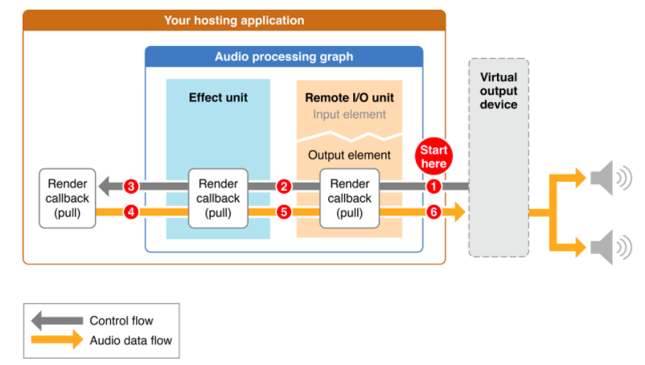

# Audio Unit范式

## AuidoUnit种类
当前的iOS上面主要提供了七种Unit：

作用 | 名称
---|---
均衡器| iPod 均衡
混音| 3D 混音
混音| 多路混音
输入输出| 远端输入输出
输入输出| VoIP 输入输出
输入输出| 通用输出
格式转换| 格式转换

这七种Unit可以分成四类：

### 均衡器单元
Effect Unit提供了类似“设置-》iPod-》EQ（均衡器）”里面调节iPod的均衡器效果，

### 混音单元
混音单元包括了多路混音和3D混音两类，3D混音单元是实现OpenAL的基础，OpenAL就是使用它来实现3D音效的，所以正常情况下，我们不需要自己来操纵这个3D混音单元来实现3D音效，更好的选择是使用后面章节介绍到的OpenAL。

而多路混音就比较常见了，假设在游戏里面的实时语音场景，此时既需要播放从网络上接受到的队友的声音，同时也需要播放游戏背景，那这个时候就可以将两路声音数据在混音单元中进行混音后再由输出单元进行播放。

### 输入输出单元
输入输出单元则有三类，其实可以认为是两类，一类是连接硬件的，一类是不连接硬件。

* 连接硬件的有“Remote I/O unit ”和“Voice-Processing I/O unit”，他们的输入就是硬件设备：麦克风，而输出就是硬件设备：扬声器。
* 不连接设备的有“Generic Output unit”只能表示输出，从其输出可以得到具体的音频数据Buffer，此时可以选择存文件或者发送到网络。

### 格式转换单元
顾名思义此单元的作用就是做为一个中间处理节点，将源数据格式，转换成另一种数据格式，比如修改编码、修改采样率等。

## AudioUnit的描述
不同的AudioUnit要如何区别或者说怎样表示呢？AudioUnit提供了"AudioComponentDescription"对象来描述一个具体的AudioUnit:

	typedef struct AudioComponentDescription {
	    OSType              componentType;
	    OSType              componentSubType;
	    OSType              componentManufacturer;
	    UInt32              componentFlags;
	    UInt32              componentFlagsMask;
	} AudioComponentDescription;
	
其中“componentType”和“componentSubType”表示了这个Unit是上面描述的那种类型。前者表示四大类，后者表示所述子类细分。“componentManufacturer”目前对于iOS就只有一个值：`kAudioUnitManufacturer_Apple `。而“componentFlags”和“componentFlagsMask”一般可以忽略给0就可以了。所以基本上就是用三个值类确定一个类型，而Apple官方文档中的
[Identifier Key](https://developer.apple.com/library/ios/documentation/MusicAudio/Conceptual/AudioUnitHostingGuide_iOS/UsingSpecificAudioUnits/UsingSpecificAudioUnits.html#//apple_ref/doc/uid/TP40009492-CH17-SW14)表格列出了每个种类个的值。

类别 | componentType | componentSubType | componentManufacturer
---|---|---|---
均衡器| kAudioUnitType_Effect  | kAudioUnitSubType_AUiPodEQ  | kAudioUnitManufacturer_Apple
3D 混音| kAudioUnitType_Mixer |  kAudioUnitSubType_AU3DMixerEmbedded  | kAudioUnitManufacturer_Apple
多路混音 | kAudioUnitType_Mixer  | kAudioUnitSubType_MultiChannelMixer  | kAudioUnitManufacturer_Apple
远端输入输出 | kAudioUnitType_Output |  kAudioUnitSubType_RemoteIO  | kAudioUnitManufacturer_Apple
VoIP 输入输出 | kAudioUnitType_Output  | kAudioUnitSubType_VoiceProcessingIO |  kAudioUnitManufacturer_Apple
通用输出 | kAudioUnitType_Output |  kAudioUnitSubType_GenericOutput |  kAudioUnitManufacturer_Apple
格式转换 | kAudioUnitType_FormatConverter |  kAudioUnitSubType_AUConverter |  kAudioUnitManufacturer_Apple

## AudioUnit的操作
前面说过了。AudioUnit单独是无法工作的，需要组建一个“Audio Unit Graph”，所以对AudioUnit的操作，基本通过“[Audio Unit Processing Graph Services](https://developer.apple.com/reference/audiotoolbox/1669790-audio_unit_processing_graph_serv)”接口就可以完成了，当如如果需要特殊的对某个Unit的修改，还可以用“[Audio Unit Component Services](https://developer.apple.com/reference/audiounit/1653800-audio_unit_component_services?language=objc)”进行设置。而AudioUnit的创建、打开和关闭则是通过“[Audio Component Services](https://developer.apple.com/reference/audiounit/1653552-audio_component_services?language=objc)”

### 单独创建AudioUnit
AudioUnit作为系统资源，需要使用时，可以通过指定条件，来获得一个具体的"AudioComponent"，也就是Audio组件，可以认为是具体的硬件设备。所以首先需要指定条件，也就是上面介绍的AudioUnit的属性。所以第一步需要更具需要指定一个`AudioComponentDescription `比如，这里我们要创建一个RemoteIO类型Unit:

	AudioComponentDescription ioUnitDescription;
	ioUnitDescription.componentType          = kAudioUnitType_Output;
	ioUnitDescription.componentSubType       = kAudioUnitSubType_RemoteIO;
	ioUnitDescription.componentManufacturer  = kAudioUnitManufacturer_Apple;
	ioUnitDescription.componentFlags         = 0;
	ioUnitDescription.componentFlagsMask     = 0;
按照上面的表格进行赋值。

这里类型为"AudioComponentDescription"，根据名字字面来看，其实际上是类型`AudioComponent`的描述，也就是Audio组件，所以通过方法：

	audioComponent AudioComponentFindNext ( AudioComponent  inComponent, const AudioComponentDescription *   inDesc)
可以从系统中获取到符合描述条件的组件。这里“inComponent”可以认为是一个链表，如果给NULL，就会从系统中找到第一个符合inDesc描述的Component，如果为其赋值，则从其之后进行寻找，比如如下代码可以找出来所有符合条件的：

	audioComponent component = AudioComponentFindNext(NULL, & ioUnitDescription);
	for (; component !=NULL;component=AudioComponentFindNext(component, & ioUnitDescription) ) {
		// your component
	}
通过遍历可以得到每个符合条件的Component。在得到Component以后就可以创建我们的AudioUnit了。通过调用：

	OSStatus AudioComponentInstanceNew(AudioComponent  inComponent, AudioComponentInstance *outInstance)
	
传入上面得到的	AudioComponent，输出就是真实的AudioComponentInstance实例。当然这里需要检查OSStatus。

哎，那说好的AudioUnit呢？这个需要看文件了，在"AudioComponent.h"中有定义：

	typedef AudioComponentInstance AudioUnit;
	
AudioUnit实际上就是	AudioComponentInstance。所以在Apple的官方文档中是这样的：

	AudioUnit ioUnitInstance;
	AudioComponentInstanceNew (foundIoUnitReference, &ioUnitInstance);
直接给的就是AudioUnit。所以可以认为	`AudioComponentInstanceNew`创建了一个AudioUnit。

### 通过AUGraph创建AudioUnit
除了通过给定条件创建一个AudioUnit之外，还有一种更简洁常用的方法。在前面介绍中我们说道，AudioUnit的使用主要通过AUGraph，它可以认为是多个AudioUnit的组合串联而成的一个有向图，所以还可以通过描述一个图结构来直接创建所有的Node上的AudioUnit。

首先通过：

	OSStatus NewAUGraph(AUGraph * outGraph)；
	
创建一个	AUGraph，然后通过方法：

	OSStatus AUGraphAddNode(AUGraph inGraph, const AudioComponentDescription *inDescription, AUNode *	outNode)
	
传入上面的创建的outGraph。以及之前的描述信息ioUnitDescription，得到输出AUNode。这个Node表示在图中的一个节点，而这个安排好的节点里面包含了需要的“AudioComponent”。那要怎么得到他呢？我们还有函数：

	OSStatus AUGraphNodeInfo(AUGraph inGraph, AUNode inNode, AudioComponentDescription *outDescription,	AudioUnit *outAudioUnit)；
传入上面的outGraph，以及之前的描述信息ioUnitDescription。还有前面的Node，就可以得到需要的AudioUnit了。

虽然是绕了一圈，但是还是得到了那个需要的AudioUnit。

## AudioUnit的结构

虽然获得了AudioUnit，那么AudioUnit到底是什么，怎么用呢？从上面的typedef知道，AudioUnit实际上就是一个AudioComponentInstance示例对象。我们可以认为他是一个具体的物理硬件对象，结构如下：

如图所示，一个AudioUnit由scopes和elements组成。可以认为Scope是AudioUnit的一个组成方面，而Element则也是一个组成方面，也就是从两个方面来看待。每个Unit都有一个输入scope和一个输出scope，输入scope用于向Unit中输入数据，有了输入自然还有个输出，输出处理的数据。我们可以将他们相信成坐标系上的X/Y坐标，由他们来指定一个具体的对象。

## AudioUnit 属性
如果按照上面的AUGraph的构建，其实一个图就构建好了。那为何还要获取AudioUnit呢？因为每个Unit还有很多属性可以配置，在使用过程中需要进行配置，比如采样率、数据格式等。通过方法：

	OSStatus AudioUnitSetProperty(AudioUnit inUnit, AudioUnitPropertyID inID, AudioUnitScope inScope, AudioUnitElement inElement, const void *inData, UInt32 inDataSize)；

这里传入Unit对象以及需要设置的scope和element表示的区域的属性值。和通常的C函数一样，这里值通过buffer和length来指定。

有设置自然需要读取：

	OSStatus AudioUnitGetProperty(AudioUnit inUnit, AudioUnitPropertyID inID, AudioUnitScope inScope, AudioUnitElement inElement, void *outData, UInt32 *ioDataSize)
	
这里和设置一样，通过scope和element表示要获取的对象，属性ID表示要获取的属性，输出内容从outData给出，而ioDataSize是个“value-result”参数，输入表示buffer长度，输出表述属性数据长度。

那我们要如何确定分配多大的内存合适呢？这里可以调用：

	OSStatus AudioUnitGetPropertyInfo(AudioUnit inUnit,AudioUnitPropertyID  inID, AudioUnitScope inScope, AudioUnitElement inElement, UInt32 *outDataSize,Boolean *outWritable)

这里来获得指定scope和element的属性的长度以及是否可以写入。

除此之外，还可以通过：

	OSStatus AudioUnitAddPropertyListener(AudioUnit inUnit, AudioUnitPropertyID inID, AudioUnitPropertyListenerProc inProc, void *inProcUserData)	
	
为属性添加一个

	void	(*AudioUnitPropertyListenerProc)(void *inRefCon, AudioUnit inUnit, AudioUnitPropertyID inID, AudioUnitScope	 inScope, AudioUnitElement inElement);

这样的回调，当Unit对应scope和element的属性变化是，可以实时的获取。	
## AUGraph的构建
通常一个最简单的AUGraph的结构是这样的：

直接从麦克风获得采集到的数据，然后不做任何处理从输出scope送到麦克风进行播放。对于IO Unit来说，Element 1 表示输入，而Element 0表示输出。

一个AUGraph通常至少需要一个IO Unit用来做输入输出功能。那要如何构建一个AUGraph呢？

1. 首先我们调用上面的AUGraph的创建AudioUnit的方法来创建AudioUnit，这样AudioUnit就自动加到Graph中了，假设加入了两个节点
2. 然后我们要组织这些节点的关系。通过函数：

	OSStatus AUGraphConnectNodeInput(AUGraph inGraph, AUNode inSourceNode, UInt32 inSourceOutputNumber, AUNode inDestNode, UInt32 inDestInputNumber);
	
将inGraph中的	inSourceNode节点的inSourceOutputNumber号bus的输出连接到 inDestNode节点的inDestInputNumber号bus的输入。

## AUGraph的驱动
AUGraph将各个AudioComponentInstance实例按照Node的方式串成一个串后，数据要如何传递？整个图又是怎样被驱动的呢？这里先看一张结构图：

当调用了“AUGraphStart”控制扬声器需要数据进行播放的时候，就会通过控制信号请求“Remote IO Unit”的输出scope中的数据，如果其中数据已经播放完了怎么办呢？

1. 这个时候，他就会找到其输入域上连接的上一级节点设置的回调函数，通过上一级的输出域数据把数据送入到“Remote IO Unit”输入域中。
2. 在这个例子中，“Remote IO Unit”的上一级是"Effect Unit"，这是时候就会请求从回调中请求“Effect Unit”输出的数据帧。
3. 对于"Effect Unit"和“Remote IO Unit”的步骤也是一样，因为其在上级没有节点了，所以会从AUGraph的回调中也就是用户可以控制的回调中取数据
4. 当取到数据后，首先从“Effect Unit”的输出scope给到“Remote IO Unit”的输入scope，最后从“Remote IO Unit”的输出scope中给到扬声器中播放。

可以看到，整个过程中最重要的就是这个回调函数了，他的原型是这样的：

	OSStatus (*AURenderCallback)(void *inRefCon, 
												AudioUnitRenderActionFlags *ioActionFlags,
												const AudioTimeStamp * inTimeStamp,
												UInt32 inBusNumber,
												UInt32 inNumberFrames,
												AudioBufferList *ioData);

各个参数的含义：

* inRefConn： 回调执行的上下文
* ioActionFlags ： 回调上下文的设置，比如没有数据了，设置成kAudioUnitRenderAction_OutputIsSilence
* inTimeStamp ： 回调被执行的时间，但是不是绝对时间，而是采样帧的数目
* inBusNumber ： 通道数
* ioData  ： 具体的使用的数据，比如播放文件时，将文件内容填入。

在回调中，我们可以对数据进行各种前处理后再进行送入，比如消除回声、降噪等。

实现了上面的回调后，还需要调用：

	OSStatus AUGraphSetNodeInputCallback(AUGraph inGraph, AUNode inDestNode, UInt32 inDestInputNumber, const AURenderCallbackStruct *inInputCallback);
	
将函数绑定到	inGraph中的节点inDestNode的inDestInputNumber号bus的输入上。需要注意的是这里回调是个结构体，其定义为：

	typedef struct AURenderCallbackStruct {
		AURenderCallback __nullable	inputProc;
		void * __nullable			inputProcRefCon;
	} AURenderCallbackStruct;
其实就是跟了一个上下文。	

## 总结

通过上面的介绍，AudioUnit实际上是由7中组成单元根据需要组合成AUGraph，通过回调为其输送或者接受数据。因此需要首先构建符合场景的Graph，并且这个Graph还可以动态的修改。然后再对每个节点设置其属性以及回调函数，最终通过AUGraph接口来驱动数据的处理，而数据的处理则依赖我们实现的回调。

在后面的章节中我们会对每个类型的Node进行介绍。比如本地回环主要使用了IO Node；而混音则结合Mix Node和IONode；播放MP3则结合了Format Node和IO Node。

## 参考
1. [Audio Unit Hosting Guide for iOS](https://developer.apple.com/library/content/documentation/MusicAudio/Conceptual/AudioUnitHostingGuide_iOS/Introduction/Introduction.html)
2. [Audio Unit Programming Guide](https://developer.apple.com/library/content/documentation/MusicAudio/Conceptual/AudioUnitProgrammingGuide/AudioUnitDevelopmentFundamentals/AudioUnitDevelopmentFundamentals.html#//apple_ref/doc/uid/TP40003278-CH7-SW5)