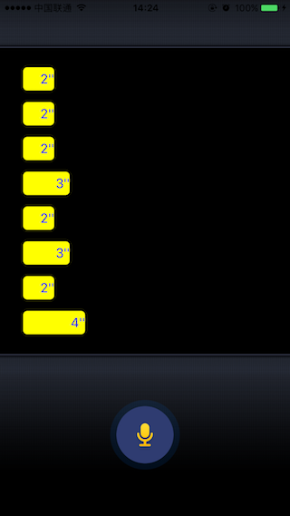

# 使用AVAudioRecorder录制音频
在iOS上播放音频我们通过AVAudioPlayer可以很方便的解决了，但是如果要录音该怎么办呢？CoreAudio同样也提供了一套非常简便但是功能强大的工具：AVAudioRecorder。

AVAudioRecorder通过系统麦克风将声音录制到本地文件，类似微信语音的效果。
## 1. 微信录音Demo
先看个例子，模拟微信语音消息的Demo：

Demo的代码可以在[GitHub](https://github.com/cz-it/play_and_record_with_coreaudio/tree/master/avfoundation/examples/AVAudioRecoderDemo)进行下载。

上面的Demo演示了点击按钮，开始进行录音，在点击按钮，录音结束。然后通过语音便条显示语音文件的时长，当点击语音便条时，进行对应录音文件的播放。当然这里的音频播放用了前面的[3.1 使用AVAudioPlayer播放音频](../avfoundation/avaudioplayer.html)中介绍的播放方法。

## 2. 使用AVAudioRecorder录制一段音频
和AVAudioPlayer一样，使用AVAudioRecorder进行录制的时，必须指定要录制到的文件，并且不同的是，AVAudioRecorder必须将录制的音频数据存入到文件中，不能像AVAudioPlayer从NSData中读取一样存入到NSData中。所以创建一个AVAudioRecorder需要指定一个存入的文件，同时因为此时我们是音频的创作者，所以还需要指定音频的格式，比如编码器、采样率、通道数等
用构造方法：

	- (nullable instancetype)initWithURL:(NSURL *)url settings:(NSDictionary<NSString *, id> *)settings error:(NSError **)outError;

来看Demo中的代码：

    NSError *error = nil;
    NSDictionary *setting = @{  AVFormatIDKey:[NSNumber numberWithInt: kAudioFormatMPEG4AAC] // aac format
                                ,AVSampleRateKey:[NSNumber numberWithInt:44100] // 44.k sample rate
                                ,AVNumberOfChannelsKey:[NSNumber numberWithInt:2] // double channel
                                ,AVLinearPCMBitDepthKey:[NSNumber numberWithInt:16] // bit depth
                              };
    NSString *docDir = [NSSearchPathForDirectoriesInDomains(NSDocumentDirectory, NSUserDomainMask, YES) firstObject];
    NSString *localFile = [NSString stringWithFormat:@"%@/%@", docDir, fileName];
    NSURL *fileURL = [NSURL URLWithString:localFile];
    _recorder = [[AVAudioRecorder alloc] initWithURL:fileURL settings:setting error:&error];
    if (nil != error) {
        NSLog(@"create recorder for[%@] error: %@", fileName, error.localizedDescription);
        return NO;
    }
    
这里首先构造一个表示音频配置信息的字典，其中设置了表示音频最基本的四个属性：
key|类型|含义
---|---|---
AVFormatIDKey| AudioFormatID|  kAudioFormatMPEG4AAC  aac音频格式
AVSampleRateKey|NSNumber|44100 44.1k 采样率
AVNumberOfChannelsKey|NSNumber| “2”表示双通道
AVLinearPCMBitDepthKey|NSNumber| “16”表示16位深度

当然除了这几个之外还有其他的设置，在下文[录音数据格式设置]()有详细介绍，也可以参考[Apple的文档](https://developer.apple.com/reference/avfoundation/1668872-av_foundation_audio_settings_con?language=objc)。

录音的文件位置，这里选择了用沙箱的Document目录进行存放，所以将位置转换成NSURL后传入到构造函数中。最后通过Error检查是否创建成功。

创建好只有就可以通过一些简单、直白的API来使用录音功能了：

录音方法 | 函数签名 | 作用
---|---|---
prepareToRecord|- (BOOL)prepareToRecord| 准备资源
record|- (BOOL)record|开始录音
pause|- (void)pause|暂停录音
stop|- (void)stop|停止录音

接口很简单，其中`prepareToRecord `可以不调用，调用`record`的时候会自动先调用。

如果按照上面的流程自己组织下代码，并且自己码了代码调试的话，会发现录制的文件始终是个小文件，且大小不变。这是怎么了呢？

其实，很多时候是没有检查`record`的返回值，上面仔细观察下，录制是有返回值的而停止和暂停是没有的。这里会返现`record`返回了"NO"，写入文件的仅仅是音频文件头。

对于AVAudioPlayer我们不需要做任何配置，直接用就好，但是对于AVAudioRecorder还要引入一个AVAudioSession的概念，他控制了当前系统是否可以录音、是否可以播放等，详细的介绍可以参见[3.3 使用AVAudioSession管理上下文](../avfoundation/avaudiosession.md)。这里在录音前，我们设置

	[[AVAudioSession sharedInstance]setActive:YES error:&error];// only need once
	
	[[AVAudioSession sharedInstance] setCategory:AVAudioSessionCategoryRecord error:&error];
	
当进行播放的时候，在设置成：
	
	[[AVAudioSession sharedInstance] setCategory:AVAudioSessionCategoryPlayback error:&error];

从字面意思基本上就可以了解作用了。

和AVAuidoPlayer一样，录制的过程也是系统提供的一个异步操作，AVAudioRecorder也提供了获取录制状态的回调delegate：AVAudioRecorderDelegate其接口主要有：

	- (void)audioRecorderDidFinishRecording:(AVAudioRecorder *)recorder successfully:(BOOL)flag;
	
	- (void)audioRecorderEncodeErrorDidOccur:(AVAudioRecorder *)recorder error:(NSError * __nullable)error;

前者标示是否录制成功了退出，后者标示在编码的过程中有出错。

用这几个接口，配合前面介绍的AVAudioPlayer就可以实现一个录音并播放的Demo了。

## 4. 录音数据格式设置	
上面的AVAudioRecorder使用确实很简单，但就是那个初始化时候的配置比较不容易理解。Apple将其分成了几大类。

### 通用格式设置

* AVFormatIDKey
	录音文件生成的格式，比如上面的kAudioFormatMPEG4AAC表示AAC，在CoreAudio.framework中定义为`AudioFormatID`,具体格式可以在“CoreAudioTypes.h”中找到。
	
* AVSampleRateKey
	音频的采样率，一般比如有8Kbps/16Kbps/44.1bps/44.8bps等，设置成对应的整形值就可以了
	
* AVNumberOfChannelsKey
	通道数，比如双声道设置成“2”,单声道设置成"1"。

### PCM裸数据设置

* AVLinearPCMBitDepthKey
	PCM数据的位深度，比如8bit/16bit/24bit/32bit
	
* AVLinearPCMIsBigEndianKey
	BOOL值，对于超过8bit的采样深度（位深度）是否采用大端序进行编码。
	
* AVLinearPCMIsFloatKey
	BOOL值，表示是否采用浮点值计数

### 编码设置
* AVEncoderAudioQualityKey
	采样率到码率转换时的质量，AVAudioQuality类型的枚举，比如低质量`AVAudioQualityMin`、高质量`AVAudioQualityHigh`

* AVEncoderBitRateKey
	整形表示的码率（编码率）。
	
* AVEncoderBitRatePerChannelKey
	整形表示的每个声道的码率
	
* AVEncoderBitRateStrategyKey
	字符串表示的编码策略，比如`AVAudioBitRateStrategy_Variable `表示VBR
	
### 采样率设置

* AVSampleRateConverterAudioQualityKey
	采样质量，AVAudioQuality类型的枚举，比如低质量`AVAudioQualityMin`、高质量`AVAudioQualityHigh`

* AVSampleRateConverterAlgorithmKey
	字符串表示采样侧率，默认为`AVSampleRateConverterAlgorithm_Normal `，或者设置成Mastering `AVSampleRateConverterAlgorithm_Mastering `

## 3. 录音器控制

### 控制录制策略
在拍照或者拍摄视频的时候，一般会有个倒计时后开始录音的功能，AVAudioRecorder也支持延时录制。

	- (BOOL)recordAtTime:(NSTimeInterval)time;

时间单位为秒，这个时间是从调用了这个接口之后n秒再开始录制。

另外除了可以指定录制时间，还可以让他自动停止，从设定录制时长。

	- (BOOL)recordForDuration:(NSTimeInterval)duration;

时间单位为秒，当录制完成时，回通过上面介绍的回调进行反馈。

当然，既想延迟又想指定时间，也是有接口的：

	- (BOOL)recordAtTime:(NSTimeInterval)time 
         forDuration:(NSTimeInterval)duration;
这里时间单位都是秒。        

如果录制后，对录音结果不满意，可以调用接口将其直接删除：

	- (BOOL)deleteRecording;
返回“YES”的时候，表示删除最近一次录制的音频。

### 录音器属性
AVAudioRecorder还提供了一些属性访问器，用来查看当前的状态：

属性| 类型| 意义
---|---|---
recording|BOOL| 是否正在录音
url| NSURL| 要录制的文件位置
channelAssignments| NSArray< AVAudioSessionChannelDescription> |  AVAudioSessionChannelDescription 表示的每个声道的属性
currentTime| NSTimeInterval| 当前已经录制的时间
settings|NSDictornary |构造的时候给的设置

这几个属性都比较好理解。其中通过"currentTime"可以获得当前已经录制的时间。Demo中就是通过这个值来算得时长并进行显示的。
>注意：当调用stop后，currentTime就会被清零了。

### 声音能量测量

和播放器一样，AVAudioRecorder也提供了获取采集音量能力的接口。

首先需要设置：

	BOOL meteringEnabled;
	
为YES，打开测试开关。然后再调用：

	- (float)peakPowerForChannel:(NSUInteger)channelNumber;
	- (float)averagePowerForChannel:(NSUInteger)channelNumber;
分别获取当前瞬时最高值和平均最高值。

> 注意：每次调用之前需先调用`- (void)updateMeters;`否则获取的值会不变。

## 4. 被Deprecate的Delegate

和AVAudioPlayerDelegate一样在最原始的版本中，AVAudioRecorderDelegate总共有6个回调，在iOS6.0中废弃掉两个，然后在iOS8.0又废掉两个。在以前的版本中被抛弃的回调接口，主要也是控制播放器在播放的过程中收到中断

比如，收到中断：

	- (void)audioRecorderBeginInterruption:(AVAudioRecorder *)recorder
当中断结束时：

	- (void)audioRecorderEndInterruption:(AVAudioRecorder *)recorder withOptions:(NSUInteger)flags 
	- (void)audioRecorderEndInterruption:(AVAudioRecorder *)recorder withOptions:(NSUInteger)flags 
	- (void)audioRecorderEndInterruption:(AVAudioRecorder *)recorder

这里不对这些函数做说明了，都已经不再推荐使用。但是要知道这里的中断基本上都是表示一些打断音频部分的流程，我们该做些什么，比如来电话了，锁屏了。那新时代的我们改如何操作呢？答案是：

> 配合AVAudioSession进行播放控制

此时就需要通过AVSession来控制收到中断以及改变输入/输出时的表现了。通过订阅AVSession的`AVAudioSessionInterruptionNotification`来判断中断了还是恢复了.
* AVAudioSessionInterruptionNotification： 
	当中断时，userInfo中会有“ AVAudioSessionInterruptionTypeBegan” 这个成员，如果是恢复回来，则是"AVAudioSessionInterruptionTypeEnded"

关于AVAudioSession的使用，可以参考[3.3 使用AVAudioSession管理上下文](../avfoundation/avaudiosession.html)。

## 5. 总结
AVAudioRecorder提供了一种不仅可以采集声音，还可以自动进行编码存文件的录音侧率。因为需要进行产生音频数据并进行编码，所以需要提供配置来对采集的声音进行采样率、编码等属性的设置。

进行录音的时候，还需要通过AudioSession将当前Session的Category设置成Record或者PlayAndRecord才能激活系统进行音频采集。

虽然AVAudioRecorder很方便好用，但是其需要将数据存到文件中，对于实时流的方式则不适用，此时还需要使用其他方式比如AudioQueueService来实现。
## 参考
1. [AVAudioRecorder Class Reference](https://developer.apple.com/reference/avfoundation/avaudiorecorder?language=objc)
2. [Audio Session Programming Guide](https://developer.apple.com/library/ios/documentation/Audio/Conceptual/AudioSessionProgrammingGuide/HandlingAudioInterruptions/HandlingAudioInterruptions.html#//apple_ref/doc/uid/TP40007875-CH4-SW1)
3. [AVAudioRecorderDelegate Class Reference](https://developer.apple.com/reference/avfoundation/avaudiorecorderdelegate?language=objc)