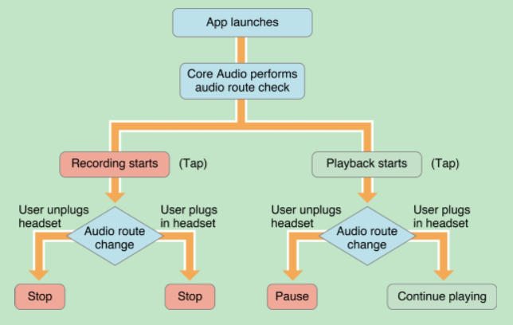

# 使用AVAudioSession管理上下文
音频输出作为硬件资源，对于iOS系统来说是唯一的，那么要如何协调和各个App之间对这个稀缺的硬件持有关系呢？

iOS给出的解决方案是"AVAudioSession" ，通过它可以实现对App当前上下文音频资源的控制，比如
插拔耳机、接电话、是否和其他音频数据混音等。当你遇到:

* 是进行录音还是播放？
* 当系统静音键按下时该如何表现？
* 是从扬声器还是从听筒里面播放声音？
* 插拔耳机后如何表现？
* 来电话/闹钟响了后如何表现？
* 其他音频App启动后如何表现？
* ...

这些场景的时候，就可以考虑一下“AVAudioSession”了。

在很久以前（其实也是不是太久--iOS7以前）还有个[AudioSession](https://github.com/cz-it/play_and_record_with_coreaudio/tree/master/avfoundation/examples/AVAudioSessionDemo)的存在，其功能与AVAudioSession类似，但是在iOS7以后就已经被标记为
“Not Applicable”,所以如果Google到了说AudioSession的内容而不是用的AVAudioSession，那么就可以直接PASS了，当然如果要兼容iOS6
就另当别论了，不过现在QQ/微信都是要求iOS7的情况下，是否需要兼容iOS6就看老板们的意思吧。

## Session默认行为

* 可以进行播放，但是不能进行录制。
* 当用户将手机上的静音拨片拨到“静音”状态时，此时如果正在播放音频，那么播放内容会被静音。
* 当用户按了手机的锁屏键或者手机自动锁屏了，此时如果正在播放音频，那么播放会静音并被暂停。
* 如果你的App在开始播放的时候，此时QQ音乐等其他App正在播放，那么其他播放器会被静音并暂停。

默认的行为相当于设置了Category为“AVAudioSessionCategorySoloAmbient” 

来看[Demo](https://github.com/cz-it/myblog/tree/master/blog/iOS/avfoundation/session/example/AVAudioSessionDemo)。

通过这播放器demo可以验证上面的默认Session行为。

## AVAudioSession
AVAudioSession以一个单例实体的形式存在，通过类方法：

	+ (AVAudioSession *)sharedInstance;
获得单例。

虽然系统会在App启动的时候，激活这个唯一的AVAudioSession，但是最好还是在自己ViewController的`viewDidLoad`里面再次进行激活：

	- (BOOL)setActive:(BOOL)active 
            error:(NSError * _Nullable *)outError;
通过设置`active `为"YES"激活Session，设置为“NO”解除Session的激活状态。BOOL返回值表示是否成功，如果失败的话可以通过NSError的`error.localizedDescription`查看出错原因。

> 因为AVAudioSession会影响其他App的表现，当自己App的Session被激活，其他App的就会被解除激活，如何要让自己的Session解除激活后恢复其他App Session的激活状态呢？
> 
> 此时可以使用：
> 	- (BOOL)setActive:(BOOL)active 
>      		withOptions:(AVAudioSessionSetActiveOptions)options 
>         		  error:(NSError * _Nullable *)outError;            
>
> 这里的options传入`AVAudioSessionSetActiveOptionNotifyOthersOnDeactivation`	即可。
> 
> 当然，也可以通过`otherAudioPlaying `变量来提前判断当前是否有其他App在播放音频。

可以通过：

	@property(readonly) NSString *category;
属性，获取当前的Category，比如上面的播放其，默认是

	 NSLog(@"Current Category:%@", [AVAudioSession sharedInstance].category);
输出：

	Current Category:AVAudioSessionCategorySoloAmbien

## 七大Category
AVAudioSession主要能控制App的哪些表现以及如何控制的呢？首先AVAudioSession将使用音频的场景分成七大类，通过设置Session为不同的类别，可以控制：

* 当App激活Session的时候，是否会打断其他不支持混音的App声音
* 当用户触发手机上的“静音”键时或者锁屏时，是否相应静音
* 当前状态是否支持录音
* 当前状态是否支持播放
每个App启动时都会设置成上面说的默认状态，即其他App会被中断同时相应“静音”键的播放模式。通过下表可以细分每个类别的支持情况：

类别|当按“静音”或者锁屏是是否静音|是否引起不支持混音的App中断| 是否支持录音和播放
---|---|---|---
AVAudioSessionCategoryAmbient | 是| 否| 只支持播放
AVAudioSessionCategoryAudioProcessing|-|都不支持
AVAudioSessionCategoryMultiRoute|否| 是| 既可以录音也可以播放
AVAudioSessionCategoryPlayAndRecord|否|默认不引起|既可以录音也可以播放
AVAudioSessionCategoryPlayback|否|默认引起|只用于播放
AVAudioSessionCategoryRecord|否|是|只用于录音
AVAudioSessionCategorySoloAmbient|是|是|只用于播放

可以看到，其实默认的就是“AVAudioSessionCategorySoloAmbient”类别。从表中我们可以总结如下：
* AVAudioSessionCategoryAmbient ： 只用于播放音乐时，并且可以和QQ音乐同时播放，比如玩游戏的时候还想听QQ音乐的歌，那么把游戏播放背景音就设置成这种类别。同时，当用户锁屏或者静音时也会随着静音，这种类别基本使用所有App的背景场景。
* AVAudioSessionCategorySoloAmbient： 也是只用于播放,但是和"AVAudioSessionCategoryAmbient"不同的是，用了它就别想听QQ音乐了，比如不希望QQ音乐干扰的App，类似节奏大师。同样当用户锁屏或者静音时也会随着静音，锁屏了就玩不了节奏大师了。
* AVAudioSessionCategoryPlayback： 如果锁屏了还想听声音怎么办？用这个类别，比如App本身就是播放器，同时当App播放时，其他类似QQ音乐就不能播放了。所以这种类别一般用于播放器类App
* AVAudioSessionCategoryRecord： 有了播放器，肯定要录音机，比如微信语音的录制，就要用到这个类别，既然要安静的录音，肯定不希望有QQ音乐了，所以其他播放声音会中断。想想微信语音的场景，就知道什么时候用他了。
* AVAudioSessionCategoryPlayAndRecord： 如果既想播放又想录制该用什么模式呢？比如VoIP，打电话这种场景，PlayAndRecord就是专门为这样的场景设计的 。
* AVAudioSessionCategoryMultiRoute： 想象一个DJ用的App，手机连着HDMI到扬声器播放当前的音乐，然后耳机里面播放下一曲，这种常人不理解的场景，这个类别可以支持多个设备输入输出。
* AVAudioSessionCategoryAudioProcessing: 主要用于音频格式处理，一般可以配合AudioUnit进行使用

了解了这七大类别，我们就可以根据自己的需要进行对应类别的设置了：

	- (BOOL)setCategory:(NSString *)category error:(NSError **)outError;

传入对应的列表枚举即可。如果返回"NO"可以通过NSError的`error.localizedDescription `查看原因。

可以通过：
	
	@property(readonly) NSArray<NSString *> *availableCategories;
属性，查看当前设备支持哪些类别，然后再进行设置，从而保证传入参数的合法，减少错误的可能。

比如修改上面的Demo例子:

        NSLog(@"Current Category:%@", [AVAudioSession sharedInstance].category);
        NSError *error = nil;
        [[AVAudioSession sharedInstance] setCategory:AVAudioSessionCategoryPlayback error:&error];
        if (nil != error) {
            NSLog(@"set Option error %@", error.localizedDescription);
        }
        NSLog(@"Current Category:%@", [AVAudioSession sharedInstance].category);

此时在播放音乐的时候，再去按下静音键，会发现，音乐还在继续播放，不会被静音。        

## 类别的选项
上面介绍的这个七大类别，可以认为是设定了七种主场景，而这七类肯定是不能满足开发者所有的需求的。CoreAudio提供的方法是，首先定下七种的一种基调，然后在进行微调。CoreAudio为每种Category都提供了些许选项来进行微调。
在设置完类别后，可以通过	

	@property(readonly) AVAudioSessionCategoryOptions categoryOptions;
属性，查看当前类别设置了哪些选项，注意这里的返回值是AVAudioSessionCategoryOptions，实际是多个options的“|”运算。默认情况下是0。

选项|适用类别| 作用
---|---|---
AVAudioSessionCategoryOptionMixWithOthers|AVAudioSessionCategoryPlayAndRecord, AVAudioSessionCategoryPlayback, and  AVAudioSessionCategoryMultiRoute| 是否可以和其他后台App进行混音
AVAudioSessionCategoryOptionDuckOthers | AVAudioSessionCategoryAmbient, AVAudioSessionCategoryPlayAndRecord, AVAudioSessionCategoryPlayback, and AVAudioSessionCategoryMultiRoute | 是否压低其他App声音
AVAudioSessionCategoryOptionAllowBluetooth| AVAudioSessionCategoryRecord and AVAudioSessionCategoryPlayAndRecord| 是否支持蓝牙耳机
AVAudioSessionCategoryOptionDefaultToSpeaker |AVAudioSessionCategoryPlayAndRecord| 是否默认用免提声音
目前主要的选项有这几种，都有对应的使用场景，除此之外，在iOS9还提供了`AVAudioSessionCategoryOptionInterruptSpokenAudioAndMixWithOthers`最新的iOS10又新加了两个`AVAudioSessionCategoryOptionAllowBluetoothA2DP`	、`AVAudioSessionCategoryOptionAllowAirPlay`用来支持蓝牙A2DP耳机和AirPlay。

来看每个选项的基本作用：

* AVAudioSessionCategoryOptionMixWithOthers ： 如果确实用的AVAudioSessionCategoryPlayback实现的一个背景音，但是呢，又想和QQ音乐并存，那么可以在AVAudioSessionCategoryPlayback类别下在设置这个选项，就可以实现共存了。
* AVAudioSessionCategoryOptionDuckOthers：在实时通话的场景，比如QQ音乐，当进行视频通话的时候，会发现QQ音乐自动声音降低了，此时就是通过设置这个选项来对其他音乐App进行了压制。
* AVAudioSessionCategoryOptionAllowBluetooth：如果要支持蓝牙耳机电话，则需要设置这个选项
* AVAudioSessionCategoryOptionDefaultToSpeaker： 如果在VoIP模式下，希望默认打开免提功能，需要设置这个选项  

通过接口：
	- (BOOL)setCategory:(NSString *)category withOptions:(AVAudioSessionCategoryOptions)options error:(NSError **)outError 
来对当前的类别进行选项的设置。

比如Demo中：

        [[AVAudioSession sharedInstance] setCategory:AVAudioSessionCategoryPlayback withOptions:AVAudioSessionCategoryOptionMixWithOthers error:&error];
        if (nil != error) {
            NSLog(@"set Option error %@", error.localizedDescription);
        }
        options = [[AVAudioSession sharedInstance] categoryOptions];
        NSLog(@"Category[%@] has %lu options",  [AVAudioSession sharedInstance].category, options);

此时，先打开QQ音乐播放器，然后再开始进行播放，会发现，QQ和我们的播放器都在播放，并且进行了自动混音。

不过这个过程，感觉CoreAudio缺少一个`setOption`的接口，既然已经是当前处于的Category，干嘛还要再设置选项的时候再指定Category呢？？疑惑。。。

## 七大模式
刚讲完七大类别，现在再来七大模式。通过上面的七大类别，我们基本覆盖了常用的主场景，在每个主场景中可以通过Option进行微调。为此CoreAudio提供了七大比较常见微调后的子场景。叫做各个类别的模式。

模式|适用的类别|场景
---|---|---
AVAudioSessionModeDefault|所有类别| 默认的模式
AVAudioSessionModeVoiceChat | AVAudioSessionCategoryPlayAndRecord |VoIP
AVAudioSessionModeGameChat | AVAudioSessionCategoryPlayAndRecord | 游戏录制，由GKVoiceChat自动设置，无需手动调用
AVAudioSessionModeVideoRecording |AVAudioSessionCategoryPlayAndRecord AVAudioSessionCategoryRecord  | 录制视频时
AVAudioSessionModeMoviePlayback |AVAudioSessionCategoryPlayback | 视频播放
AVAudioSessionModeMeasurement |AVAudioSessionCategoryPlayAndRecord AVAudioSessionCategoryRecord AVAudioSessionCategoryPlayback| 最小系统
AVAudioSessionModeVideoChat | AVAudioSessionCategoryPlayAndRecord | 视频通话

每个模式有其适用的类别，所以，并不是有“七七 四十九”种组合。如果当前处于的类别下没有这个模式，那么是设置不成功的。设置完Category后可以通过：

	@property(readonly) NSArray<NSString *> *availableModes;
属性，查看其支持哪些属性，做合法性校验。

来看具体应用：

* AVAudioSessionModeDefault： 每种类别默认的就是这个模式，所有要想还原的话，就设置成这个模式。
* AVAudioSessionModeVoiceChat：主要用于VoIP场景，此时系统会选择最佳的输入设备，比如插上耳机就使用耳机上的麦克风进行采集。此时有个副作用，他会设置类别的选项为"AVAudioSessionCategoryOptionAllowBluetooth"从而支持蓝牙耳机。
* AVAudioSessionModeVideoChat ： 主要用于视频通话，比如QQ视频、FaceTime。时系统也会选择最佳的输入设备，比如插上耳机就使用耳机上的麦克风进行采集并且会设置类别的选项为"AVAudioSessionCategoryOptionAllowBluetooth" 和 "AVAudioSessionCategoryOptionDefaultToSpeaker"。
* AVAudioSessionModeGameChat ： 适用于游戏App的采集和播放，比如“GKVoiceChat”对象，一般不需要手动设置

另外几种和音频APP关系不大，一般我们只需要关注VoIP或者视频通话即可。

通过调用：

	- (BOOL)setMode:(NSString *)mode error:(NSError **)outError
可以在设置Category之后再设置模式。

> 当然，这些模式只是CoreAduio总结的，不一定完全满足要求，对于具体的模式，在iOS10中还是可以微调的。通过接口：
> 
> 	- (BOOL)setCategory:(NSString *)category mode:(NSString *)mode options:(AVAudioSessionCategoryOptions)options error:(NSError **)outError
> 
> 但是在iOS9及以下就只能在Category上调了，其实本质是一样的，可以认为是个API糖，接口封装。

## 系统中断响应
上面说的这些Category啊、Option啊以及Mode都是对自己作为播放主体时的表现，但是假设，现在正在播放着，突然来电话了、闹钟响了或者你在后台放歌但是用户启动其他App用上面的方法影响的时候，我们的App该如何表现呢？最常用的场景当然是先暂停，待恢复的时候再继续。那我们的App要如何感知到这个终端以及何时恢复呢？

AVAudioSession提供了多种Notifications来进行此类状况的通知。其中将来电话、闹铃响等都归结为一般性的中断，用
`AVAudioSessionInterruptionNotification `来通知。其回调回来的userInfo主要包含两个键：

* AVAudioSessionInterruptionTypeKey： 取值为`AVAudioSessionInterruptionTypeBegan`表示中断开始，我们应该暂停播放和采集，取值为`AVAudioSessionInterruptionTypeEnded`表示中断结束，我们可以继续播放和采集。
* AVAudioSessionInterruptionOptionKey： 当前只有一种值`
AVAudioSessionInterruptionOptionShouldResume`表示此时也应该恢复继续播放和采集。

而将其他App占据AudioSession的时候用`AVAudioSessionSilenceSecondaryAudioHintNotification `来进行通知。其回调回来的userInfo键为：

	AVAudioSessionSilenceSecondaryAudioHintTypeKey
可能包含的值：
* AVAudioSessionSilenceSecondaryAudioHintTypeBegin： 表示其他App开始占据Session
* AVAudioSessionSilenceSecondaryAudioHintTypeEnd: 表示其他App开始释放Session
	

## 外设改变

除了其他App和系统服务，会对我们的App产生影响以外，用户的手也会对我们产生影响。默认情况下，AudioSession会在App启动时选择一个最优的输出方案，比如插入耳机的时候，就用耳机。但是这个过程中，用户可能拔出耳机，我们App要如何感知这样的情况呢？

同样AVAudioSession也是通过Notifications来进行此类状况的通知。

假设有这样的App：

最开始在录音时，用户插入和拔出耳机我们都停止录音，这里通过Notification来通知有新设备了，或者设备被退出了，然后我们控制停止录音。或者在播放时，当耳机被拔出出时，Notification给了通知，我们先暂停音乐播放，待耳机插回时，在继续播放。

在NSNotificationCenter中对AVAudioSessionRouteChangeNotification进行注册。在其userInfo中有键：

* AVAudioSessionRouteChangeReasonKey ： 表示改变的原因
枚举值|意义
---|---
AVAudioSessionRouteChangeReasonUnknown | 未知原因
AVAudioSessionRouteChangeReasonNewDeviceAvailable | 有新设备可用
AVAudioSessionRouteChangeReasonOldDeviceUnavailable | 老设备不可用
AVAudioSessionRouteChangeReasonCategoryChange | 类别改变了
AVAudioSessionRouteChangeReasonOverride | App重置了输出设置
AVAudioSessionRouteChangeReasonWakeFromSleep |  从睡眠状态呼醒
AVAudioSessionRouteChangeReasonNoSuitableRouteForCategory | 当前Category下没有合适的设备
AVAudioSessionRouteChangeReasonRouteConfigurationChange | Rotuer的配置改变了

* AVAudioSessionSilenceSecondaryAudioHintTypeKey： 和上面的中断意义意义。

## 总结：
AVAudioSession构建了一个音频使用生命周期的上下文。当前状态是否可以录音、对其他App有怎样的影响、是否响应系统的静音键、如何感知来电话了等都可以通过它来实现。尤为重要的是AVAudioSession不仅可以和AVFoundation中的AVAudioPlyaer/AVAudioRecorder配合，其他录音/播放工具比如AudioUnit、AudioQueueService也都需要他进行录音、静音等上下文配合。

文中Demo参见[GitHub](https://github.com/cz-it/play_and_record_with_coreaudio/tree/master/avfoundation/examples/AVAudioSessionDemo)

## 参考文档
1. [Audio Session Programming Guide](https://developer.apple.com/library/ios/documentation/Audio/Conceptual/AudioSessionProgrammingGuide/Introduction/Introduction.html#//apple_ref/doc/uid/TP40007875-CH1-SW1)
2. [AVAudioSession Class Reference](https://developer.apple.com/reference/avfoundation/avaudiosession)
3. [ Audio Session Services Reference](https://developer.apple.com/library/ios/documentation/AudioToolbox/Reference/AudioSessionServicesReference/)
