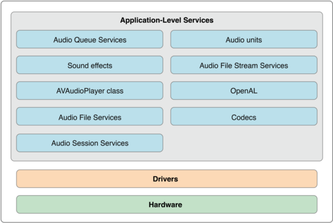
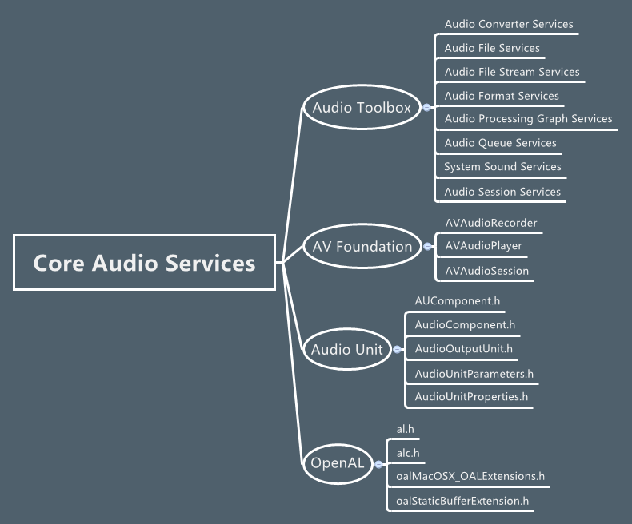
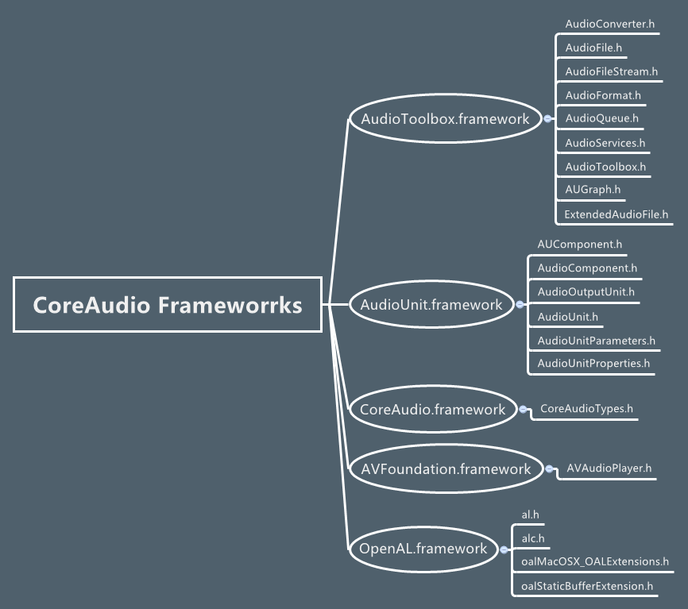

# CoreAudio是什么

CoreAudio是Apple提供的在iOS/OS X（macOS）上进行音频处理的解决方案。虽然Apple有个framewok叫CoreAudio.framework，
但是这里说的CoreAudio并不是仅仅指的这一个framework而是又一系列[Framework](#framework)组成的音频工具的集。OS X(macOS)在音频界一直是pc工具的首选（youtube上的各种网红录音设备都是iMac），主要就是得益于CoreAudio提供的低延迟的AudioUnit等工具。不过这里我们主要聚焦在iOS，看在iPhone上的音频到底怎么处理。

先看下CoreAudio在iOS中的结构：

可以看到CoreAudio是由驱动层之上的各种Service组成，归纳来看主要有：

与这些services对应的Framework提供了使用这些services的接口：

可以看到这里的frameworks与各个service基本是对应的。这些framework除了上面列出来的功能和头文件外，还有其他功能，比如在OS X(macOS)上特有的接口、AVFoundation中和视频相关的接口等，当然还有通过iPod直接播放歌曲的MediaPlayer.framework没有罗列在这里。

##1. AVFoundation
AVFoundation 是Apple提供的一套处理音视频的上层Objective-C接口(当然现在也有Swift接口)。其包括Audio和Video两部分。其中服务于CoreAudio的主要由三个外层接口组成：
* AVAudioSession: 用来替代iOS6以前的AudioSession，管理录制和播放音频的上下文环境。
* AVAudioPlayer: 用来播放音频文件，文件格式支持PCM、AAC、MP3等常见格式。
* AVAudioRecorder: 用来录制音频到文件，文件格式支持PCM、AAC、MP3等常见格式。

这里的AVAudioSession不仅可以用于AVAudioPlayer&AVAudioRecorder对其他录音/播放接口也适用，他主要包含三大块功能

* 用来控制录音还是播放、请求录音权限
* 用来处理系统中断，比如打电话、闹钟响、按下Home键等
* 用来处理硬件播放/录制设备管理，比如插入耳机

通过SetCategory设置模式，通过注册 NSNotification来感知相应的中断。

##2. AudioToolBox
这里Box就意味这个AudioToolBox是一个大杂烩，不是属于其他明确分类的接口都放在了这里。比如
* 格式转换的Audio Converter Services、Audio Format Services
* 已经被Deprecated(iOS6)的Auido Session
* 播放系统音，如按键音、点击Button音、告警音
* 使用Audio File Stream Services 播放来自网络的流媒体音频

AudioToolBox也提供了一种录制和播放音频的方式，就是通过AudioFileService和AudioQueueService将文件中的或者来自网络上的音频流给到AudioQueue去调度安排播放。

##3. AudioUnit
在OS X(macOS)上面，AudioUnit绝对是个主角，用来对这种硬件扩展进行低延迟的音频采集等功能，而在iOS上，则是一个比较底层的接口，后面说的OpenAL也是基于AudioUnit进行采集和播放的，可以近似的认为AudioUnit就是对硬件驱动的封装，通过他获取麦克风采集的音频数据或者将数据通过他送到扬声器进行播放。

一般情况下比如播放背景音，直接使用MediaPlayer或者AVAudioPlayer就可以了，AudioUnit在iOS上主要用于对时延要求比较高的场景，比如实时语音、VoIP的场景。

##4. OpenAL

OpenAL是Apple提供的在iOS/OS X(macOS)上对OpenAL的实现，在iOS上是基于AudioUnit，提供OpenAL的C接口，主要是方便游戏或者C/C++写的逻辑依赖OpenAL接口做跨平台实现。使用上按照OpenAL接口风格即可。

## 总结

* 如果一般的播放文件内容，或者一段内存的编码内容，优先考虑AVAudioPlayer
* 如果是播放来自网络流的数据，或者是拼接的内存数据，优先考虑AudioToolBox里面的AudioQueueService
* 如果是为了C++层兼容接口或者熟悉OpenAL，则可以用OpenAL接口
* 如果是VoIP或者其他实时语音聊天场景，则考虑底层的AudioUnit接口。

总的来说，iOS上可以通过AVFoundation、AudioQueueService、AudioUnit以及OpenAL来进行音频录制和播放。除此之外还可以通过MediaPlayer中的MPMusicPlayerController播放iPhone里面的iPod音乐。播放系统警告音则需要用到AudioToolBox里面的SystemSound。

##参考文档
1. [Core Audio Overview](https://developer.apple.com/library/mac/documentation/MusicAudio/Conceptual/CoreAudioOverview/Introduction/Introduction.html)
2. [Multimedia Programming Guide - Using Audio](https://developer.apple.com/library/ios/documentation/AudioVideo/Conceptual/MultimediaPG/UsingAudio/UsingAudio.html#//apple_ref/doc/uid/TP40009767-CH2-SW6)
